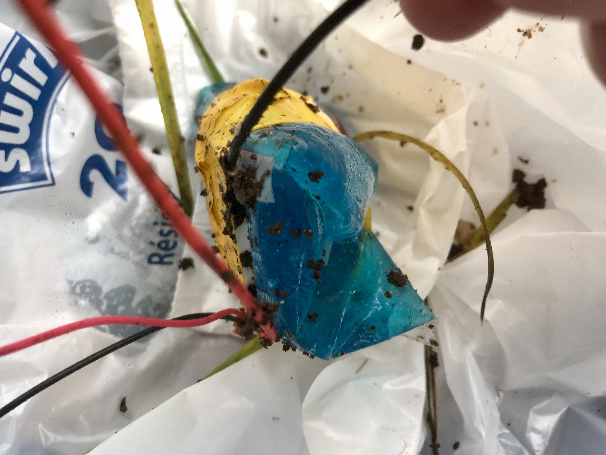
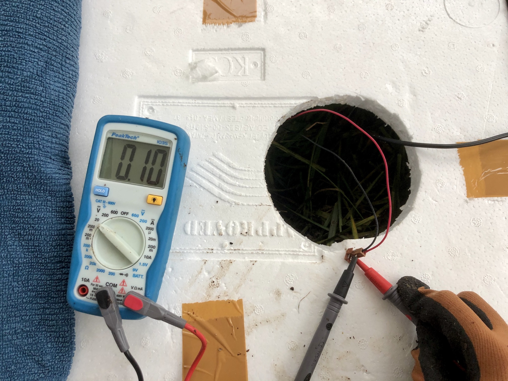
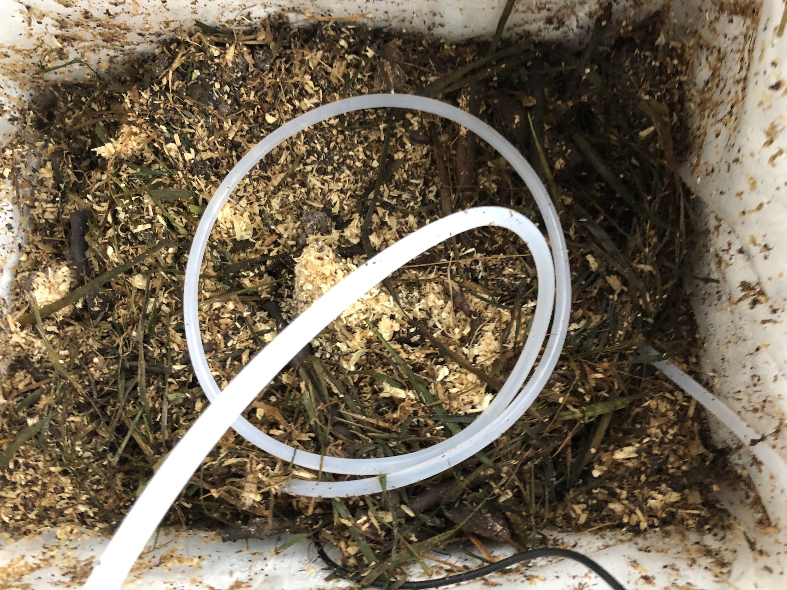
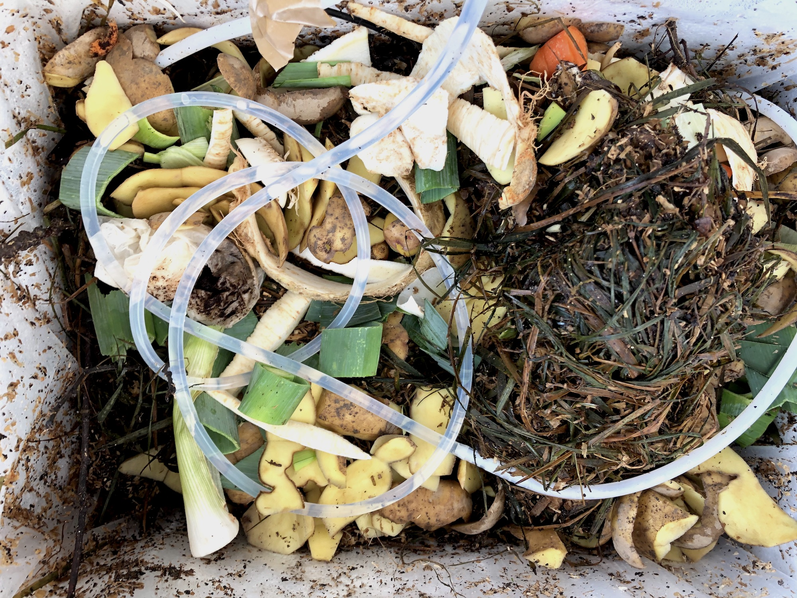

# Testkompost C1

## 24. September 2020, 16:25 Uhr
- Kompost angelegt
- Methode: [[Berkeley Hot Composting Method]]
- Container: Styroporbox mit Deckel
- Schichten: Zeitungspapier, frisches Gras + Gemüseabfälle, [[Dehner Kompostbeschleuniger]], Sägespähne, [[Dehner Kompostbeschleuniger]], frisches Gras, [[Dehner Kompostbeschleuniger]]
- mit der Gießkanne bewässert
- Temperatur: 23,72 °C

## 26. September 2020, 15:05 Uhr
- Temperatur: 51,24 °C
- ein Peltier-Element mit medizinischem Kühlpack in den Komposthaufen eingesetzt, resultierende Spannung: ~ 0,1 V

## 28. September 2020, 10:30 Uhr
- Kompost gewendet (innenliegender Inhalt nach außen, außenliegender Inhalt nach innen)
- Temperatur nach dem Umschichten: 24,69 °C

## 1. Oktober 2020, 12:20 Uhr
- Kompost gewendet
- Temepratur nach dem Umschichten: 29,35 °C

## 1. Oktober 2020, 18:03 Uhr
- Temperatur: 37,13 °C

## 3. Oktober 2020, 12:10 Uhr
- Kompost gewendet
- Temperatur nach dem Umschichten: 34,88 °C

## 3. Oktober 2020, 19:56 Uhr
- Temperatur: 38,31 °C

## 5. Oktober 2020, 18:30 Uhr
- Kompost gewendet
- Temperatur nach dem Umschichten: 31,58 °C

## 6. Oktober 2020, 8:58 Uhr
- Temperatur: 33,88 °C

## 7. Oktober 2020, 11:00 Uhr
- Kompost gewendet
- Temperatur nach dem Umschichten: 28,315 °C

## 7. Oktober 2020, 21:05 Uhr
- Temperatur: 31,13 °C

## 8. Oktober 2020, 16:50 Uhr
- Kompost gewendet
- Wasserschlauch eingesetzt, Pumpe angeschlossen
  

<iframe width="560" height="315" sandbox="allow-same-origin allow-scripts allow-popups" src="https://betamax.video/videos/embed/f8961993-f810-47a1-b2e5-5f27ee0ad8ba" frameborder="0" allowfullscreen></iframe>

## 13. Oktober 2020, 14:30 Uhr
- neues Material aufgeschichtet: Bioabfälle, Kompostbeschleuniger, Zeitungspapier
- mit der Gießkanne bewässert
- Temepratur: 23,75 °C

## 14. Oktober 2020, 15:20 Uhr
- neues Material aufgeschichtet: Bioabfälle
- Temperatur: 25,31 °C

## 15 Oktober 2020, 10:50 Uhr
- Kompost gewendet
- Temperatur nach dem Umschichten: 25,91 °C

[//begin]: # "Autogenerated link references for markdown compatibility"
[Berkeley Hot Composting Method]: berkeley-hot-composting-method "Berkeley Hot Composting Method"
[Dehner Kompostbeschleuniger]: dehner-kompostbeschleuniger "Dehner Kompostbeschleuniger"
[//end]: # "Autogenerated link references"